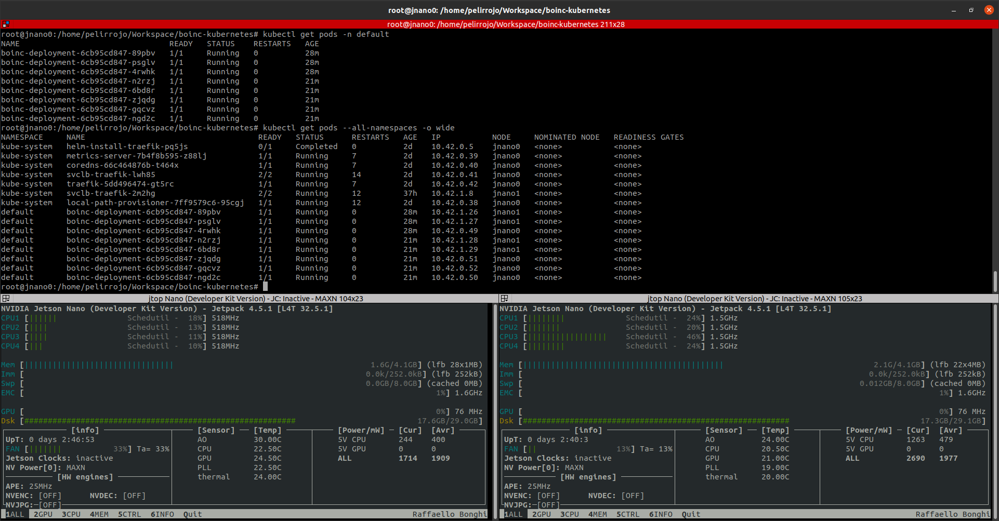

# boinc-kubernetes

Deploying a Boinc pod in k8s with 3 tasks

```bash

  $> export KUBECONFIG=/etc/rancher/k3s/k3s.yaml (particular requirement for k3s)

  # Load Credentials in a secret
  $> kubectl apply -f ./secrets.yaml

  $ Apply deployment
  $> kubectl apply -f ./boinc_client.yaml

  # We can check that everything went fine with the kubectl commands:

  $> kubectl describe pod boinc-deployment          # Describe deployment stats
  $> kubectl get pods -n default                    # List all pods from default (boinc-deployment-*)
  $> kubectl logs <POD_ID> -n default               # Log from a pod
  $> kubectl get pods --all-namespaces -o wide      # Pod by container
  
```

Screenshot




TODOs

- [x] Add kubernetes support
- [x] Using secrets template to avoid to push credentials
- [ ] Add other container definitions for armhf instead arm64
- [ ] Document the way to access a pod (guacamole GUI)
- [ ] Try to connect with GPU (Jetson Nano)

References:

* https://www.suse.com/c/running-edge-artificial-intelligence-k3s-cluster-with-nvidia-jetson-nano-boards-src/
* https://www.elarraydejota.com/despliegue-de-boinc-en-k8s/
* https://boinc.berkeley.edu/wiki/Boinccmd_tool
* https://scienceunited.org/forum_thread.php?id=82
